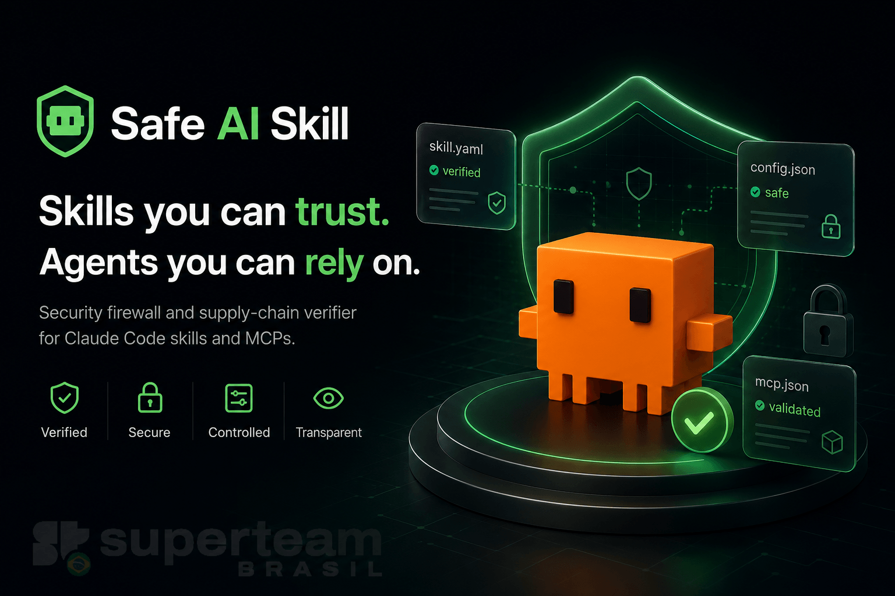

<p align="center">
  
</p>

<p align="center">
  <a href="https://github.com/solanabr/safe-ai-skill/actions/workflows/ci.yml"></a>
  
  
  
  
</p>

# safe-ai-skill

safe-ai-skill is a Claude Code security plugin — a Rust hook-based firewall and registry-free supply-chain verifier that works with **any skills, MCPs, or agents** to add a policy-driven security layer. It was built with `solanabr/solana-ai-kit` as the reference integration (gating Solana transactions and deploys, verifying its `ext/` submodules and `skill-registry.json` catalog), but the gates, guards, and verifier are general-purpose and protect any Claude Code setup.

At `PreToolUse` it intercepts commands, MCP calls, and secret-file reads before they execute. At `SessionStart` it walks every installed skill and MCP submodule, pins content to git SHAs, and quarantines anything that drifted. Hard guards — mainnet deploys, authority changes, account closes, secret reads — are never bypassed regardless of profile or flags.

## Install

safe-ai-skill has two layers. The **plugin** is the always-on runtime firewall (SessionStart verifier + PreToolUse gates). The **CLI** is the `safe-ai-skill` binary that powers the Tier 1/2 commands (`registry`, `add skill`, `add mcp`, `install`, `verify`, `status`). Most users want the plugin; install the CLI too if you want to gate skill/MCP installs before they run.

### Plugin (runtime firewall)

```bash
claude plugin marketplace add solanabr/safe-ai-skill
claude plugin install safe-ai-skill@stbr
```

Every Claude Code session is protected automatically from that point. No per-project configuration required.

**Dev install:** `claude plugin marketplace add .` from the repo root, then `claude plugin install safe-ai-skill@stbr`.

### CLI (`safe-ai-skill` command)

The plugin runs the firewall; the Tier 1/2 commands need the `safe-ai-skill` binary on your `PATH`. Pick one:

**npm**

```bash
npm install -g @stbr/safe-ai-skill           # installs the CLI globally (command: safe-ai-skill)
npx @stbr/safe-ai-skill add skill <name|url>  # or run without installing
```

`safe-ai-skill add skill <name|url>` is the headline command — it runs the full verification pipeline on the fetched content before any install touches your machine (see [Usage tiers](#usage-tiers)).

**Standalone script** (no npm or cargo)

```bash
curl -fsSL https://raw.githubusercontent.com/solanabr/safe-ai-skill/main/install.sh | sh
```

Downloads the prebuilt binary for your platform and verifies its SHA-256 against the release's published `SHA256SUMS` before installing — checksum-pinned, not an opaque pipe. Set `SAFE_AI_SKILL_BIN_DIR` to override the install location (default `~/.local/bin`).

**cargo** (any platform with a Rust toolchain)

```bash
cargo install safe-ai-skill
```

The npm and standalone paths download the binary matching their release tag and abort on any checksum mismatch.

## What it protects

**Runtime (PreToolUse firewall)**

- CLI commands: any `solana`, `spl-token`, `anchor`, or arbitrary shell command matching policy
- MCP calls: value-moving and authority-changing verbs (`send*`, `stake*`, `delegate*`, `mint*`, `bridge*`, `lend*`, `borrow*`) across any connected MCP
- Secret reads: `.env`, keypair files, credential paths
- Interactive gate breakage: replaces broken `read -r` prompts (no TTY in hook context) with a functioning `ask` decision

**Supply-chain (SessionStart verifier)**

- Per-submodule pinning: walks each `ext/` submodule independently; pins first-seen git SHA (TOFU); quarantines drift
- Catalog gating: classifies `skill-registry.json` entries by risk class (`wallet_signing`, `key_custody`, `installer_script`, `standard`); blocks installation of denied classes
- `curl | bash` detection: flags installer-script patterns before they execute
- MCP version tracking: flags `@latest` entries as informational — does not silently rewrite them
- CVE lookup: queries osv.dev for every resolved `pkg@version` (no API key required)
- Heuristic scan: outbound POST in preambles, keypair/`.env` references, base58-encoded secrets, prompt injection, `eval`/download-and-exec

**Hard guards (never relaxable)**

`mainnet_deploy` · `set_authority` · `account_close` · `secret_read`

These block unconditionally. No profile flag or explicit grant overrides them.

## Threat model

**Runtime threats** — agentic workflows drive CLI commands and value-moving MCP calls with no gating. Interactive `read -r` prompts silently fail in hook context (no TTY). safe-ai-skill intercepts every such action before execution.

**Supply-chain threats** — skill hubs ship external submodules from third-party sources. Each submodule is its own supply-chain unit and can contain telemetry preambles, `curl | bash` installer scripts, or unpinned MCP packages. Opt-in skill catalogs include high-risk entry classes that can execute privileged code. safe-ai-skill catches all of this at session start, before any skill or MCP is active.

## Usage tiers

### Tier 0 — install and go

Install once. Every session is protected automatically. No configuration required.

### Tier 1 — gate installs before they run

```bash
safe-ai-skill registry list          # list catalog entries with risk classification
safe-ai-skill registry verify        # audit installed entries against registry
safe-ai-skill add skill <name|url>   # catalog entry or any GitHub URL, verified before install
safe-ai-skill add mcp <id|pkg|url>   # any MCP; verified before writing .mcp.json
safe-ai-skill verify                 # on-demand audit of all installed skills and MCPs
safe-ai-skill status                 # pins, quarantine list, active profile, live grants, recent decisions
safe-ai-skill mode <profile>         # switch relaxation profile (strict / standard / dev)
safe-ai-skill allow <gate>           # grant a specific gate for the current session
safe-ai-skill session                # show active session state
```

Each `add` command runs the intrinsic verification pipeline on the actual fetched content before executing the underlying install. `registry list` shows the full catalog with risk classes flagged. High-risk entries (`wallet_signing`, `key_custody`, `installer_script`) require explicit approval.

### Tier 2 — verified hub install

```bash
safe-ai-skill install                        # verified install of a skill hub
safe-ai-skill install --from <url>           # install from a specific source URL or GitHub ref
safe-ai-skill install --home ~/.claude       # override install destination
```

The `install` subcommand is the secure drop-in for `curl <url> | bash`. It downloads the target hub, runs the verification pipeline on every SKILL.md and catalog entry, walks each `ext/` submodule individually, pins each to its current git SHA, flags `@latest` MCP entries, shows a diff of flagged content, and installs only on approval. It does not auto-widen `~/.claude/settings.json` permissions.

## Registry-free verification model

Trust is based on the artifact itself, not a hash allowlist to maintain:

1. **Static heuristics** — scan SKILL.md, scripts, and package.json for outbound POST in preambles, keypair/`.env` references, base58-encoded secrets, prompt injection, `eval`/download-and-exec, and `curl | bash` patterns. Generic patterns — they do not grow per-package.
2. **Per-submodule pinning** — each `ext/` submodule is walked independently. The first-seen git commit SHA is recorded as the TOFU pin. On subsequent sessions, drift from that SHA triggers quarantine and a diff for review.
3. **Catalog gating** — entries are classified by risk class. High-risk classes require explicit policy approval; safe-ai-skill blocks installation of denied classes without prompting.
4. **Provenance pinning** — GitHub URLs resolve to immutable commit SHAs (moving refs are rejected). npm packages pin to `pkg@x.y.z` plus `dist.shasum`. `@latest` entries are flagged informational.
5. **CVE lookup** — query osv.dev for every resolved `pkg@version`. No API key required.
6. **Local TOFU lockfile** — pin the content hash on first install; any later change surfaces a diff requiring explicit approval.

Block on high-severity heuristic match or known CVE. Warn and `ask` on medium. Pass and pin on clean.

## Integration model

Install any skill hub (e.g. `solanabr/solana-ai-kit`) alongside safe-ai-skill as a plugin. No `settings.json` merge is needed — Claude Code merges plugin hooks with project hooks automatically. safe-ai-skill's `deny` decisions survive `enableAllProjectMcpServers: true` and `bypassPermissions`.

safe-ai-skill is standalone — it can be installed independently of any particular skill hub. It adds a security and control layer over whatever skills, MCPs, and agents you already have.

## Security

See [SECURITY.md](SECURITY.md) for the full threat model, guarantees, out-of-scope items, and vulnerability reporting.

## License

MIT
